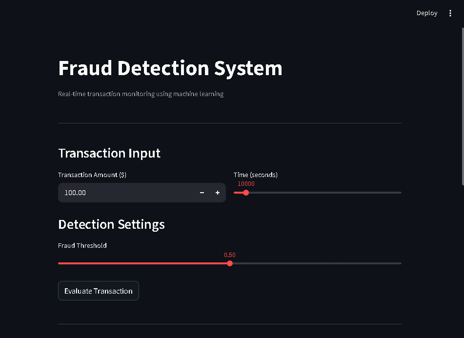
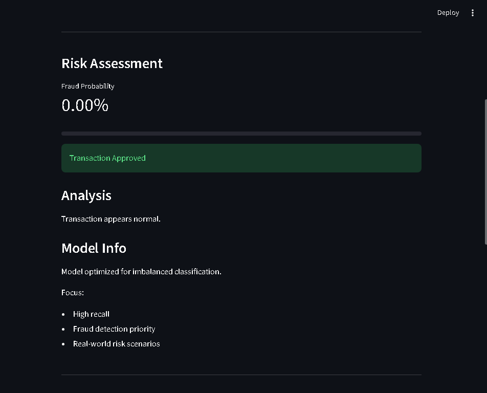
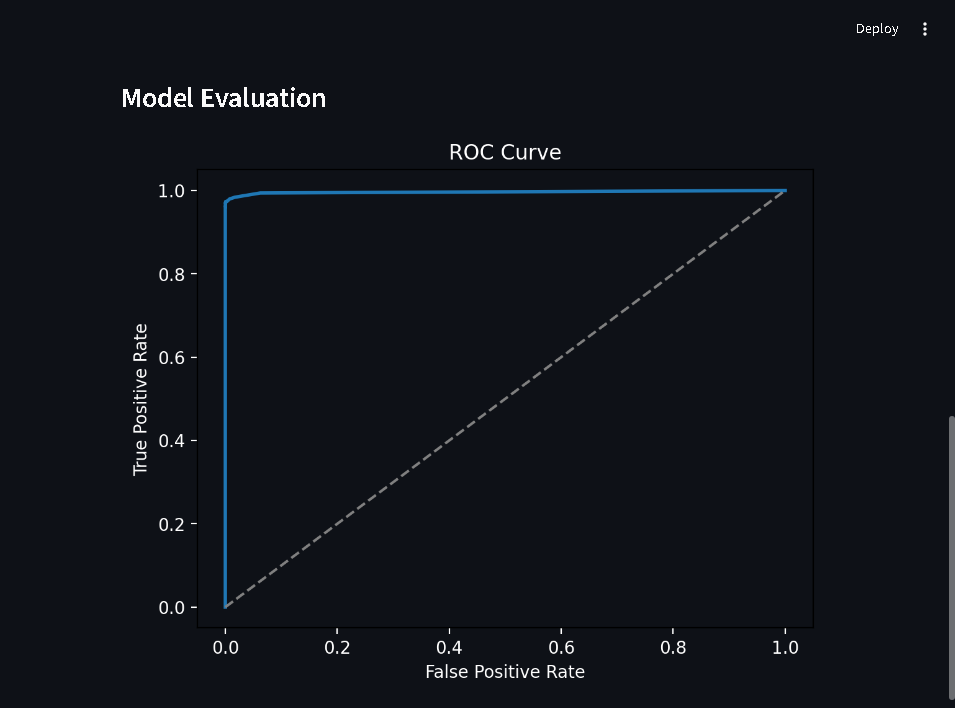
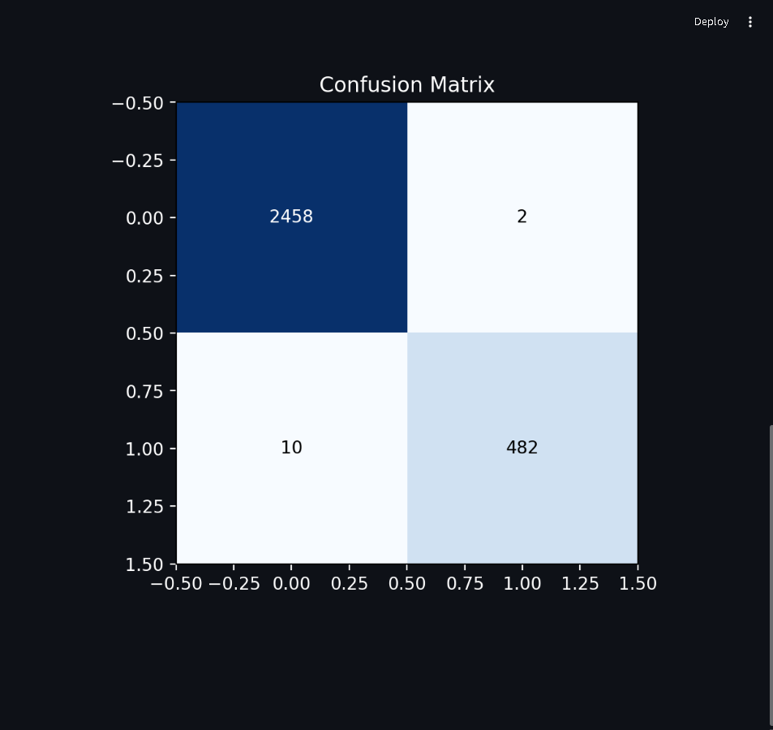

# Fraud Detection AI | Machine Learning Fraud Detection System

Fraud Detection AI is a machine learning application designed to identify potentially fraudulent financial transactions using an imbalanced classification approach.

The project simulates a real-time fraud detection workflow where a model estimates fraud probability, applies a configurable decision threshold, and supports transaction approval or alert decisions.

---

## Live Demo

https://fraud-detection-ai-s2xftbqgz8mffnelg5xgsr.streamlit.app/

---

## Repository

https://github.com/camargoluisenrique/fraud-detection-ai

---

## Project Overview

Fraud detection is a high-impact machine learning problem where fraudulent transactions represent a very small percentage of total activity.

In this type of problem, accuracy alone is not enough. A model can appear accurate while still missing the most important cases. For that reason, this project focuses on detecting rare fraudulent events while keeping false positives under control.

The application includes:

- Transaction risk evaluation
- Fraud probability estimation
- Adjustable decision threshold
- ROC curve visualization
- Confusion matrix visualization
- Streamlit deployment
- Lightweight sample dataset suitable for GitHub

---

## Application Preview

### Main Application



### Risk Assessment



### ROC Curve



### Confusion Matrix



---

## Problem Context

Financial fraud detection is naturally imbalanced. Most transactions are legitimate, while fraudulent activity represents a very small percentage of the dataset.

The main challenge is to identify suspicious transactions without overwhelming the system with excessive false positives.

The goal of this project is to build a practical fraud detection workflow that can:

- Learn from imbalanced transaction data
- Estimate fraud probability
- Support threshold-based decisions
- Provide visual model evaluation
- Serve as a deployed portfolio project

---

## Dataset

The original dataset is large and highly imbalanced, so the repository uses a prepared sample for demonstration purposes.

The sample keeps all available fraud cases and includes a representative subset of legitimate transactions.

Current sample:

| Class | Description | Records |
|---|---:|---:|
| 0 | Legitimate transactions | 50,000 |
| 1 | Fraudulent transactions | 492 |

Total records:

```text
50,492 rows
```

Fraud proportion:

```text
0.97%
```

This keeps the repository lightweight while preserving the imbalanced nature of the problem.

The full original dataset is not included in the repository because of file size limitations and repository best practices.

---

## Machine Learning Approach

The project follows an end-to-end machine learning workflow:

1. Load transaction data.
2. Prepare features and target variable.
3. Split data using stratified sampling.
4. Train a classification model.
5. Handle class imbalance using class weights.
6. Evaluate performance using classification metrics.
7. Generate ROC curve and confusion matrix.
8. Deploy the model with Streamlit.

---

## Model

The current model uses:

| Component | Detail |
|---|---|
| Algorithm | Random Forest Classifier |
| Target | `Class` |
| Positive class | Fraudulent transaction |
| Imbalance handling | `class_weight="balanced"` |
| Evaluation | ROC AUC, classification report, confusion matrix |
| Deployment | Streamlit |

The model is trained to prioritize detection of fraudulent transactions while maintaining reasonable control over false positives.

---

## Model Performance

The current model evaluation shows strong performance on the prepared imbalanced sample.

Example validation output:

```text
ROC AUC: approximately 0.98
```

Classification report summary:

| Class | Precision | Recall | F1-score |
|---|---:|---:|---:|
| Legitimate transactions | High | High | High |
| Fraudulent transactions | High | Strong | Strong |

The most important metric in this case is not only overall accuracy, but the ability to correctly identify fraudulent transactions.

---

## Application Features

The Streamlit application allows users to:

- Enter a transaction amount
- Select transaction time
- Adjust the fraud detection threshold
- Evaluate a transaction in real time
- View fraud probability
- Receive an approval or high-risk alert
- Review ROC curve
- Review confusion matrix

This simulates a simplified version of a monitoring interface used in financial risk systems.

---

## Project Structure

```text
fraud-detection-ai/
├── app.py
├── README.md
├── requirements.txt
├── data/
│   └── fraud_sample.csv
├── images/
│   ├── fraud-detection-app-preview.png
│   ├── fraud-detection-risk-assessment.png
│   ├── fraud-detection-roc-curve.png
│   └── fraud-detection-confusion-matrix.png
├── src/
│   ├── __init__.py
│   ├── model.py
│   └── prepare_sample.py
├── notebooks/
└── outputs/
    └── models/
```

---

## Key Files

| File | Purpose |
|---|---|
| `app.py` | Streamlit application interface |
| `src/model.py` | Model training, loading, prediction and metrics |
| `src/prepare_sample.py` | Dataset preparation utility |
| `data/fraud_sample.csv` | Lightweight sample dataset used by the app |
| `requirements.txt` | Project dependencies |
| `images/` | Screenshots used in the README |

---

## Technical Stack

- Python
- Pandas
- Scikit-learn
- Matplotlib
- Streamlit
- Git / GitHub

---

## Run Locally

Clone the repository:

```bash
git clone https://github.com/camargoluisenrique/fraud-detection-ai.git
cd fraud-detection-ai
```

Create and activate a virtual environment:

```bash
python -m venv venv
```

On Windows PowerShell:

```bash
.\venv\Scripts\Activate.ps1
```

Install dependencies:

```bash
pip install -r requirements.txt
```

Run the application:

```bash
streamlit run app.py
```

---

## Notes About the Dataset

The repository does not include the full raw dataset.

The project uses a prepared sample to keep the repository lightweight and easy to run. The sample preserves all fraudulent cases available in the source data and includes a larger subset of legitimate transactions to maintain a more realistic imbalance.

Ignored files include:

```text
data/archive/
outputs/
venv/
__pycache__/
```

This prevents large datasets, generated models and local environment files from being uploaded to GitHub.

---

## Future Improvements

Potential improvements for this project include:

- Add cost-sensitive threshold optimization
- Add Precision-Recall curve
- Add feature importance visualization
- Add batch scoring for multiple transactions
- Add REST API deployment with FastAPI
- Add Docker deployment instructions
- Add monitoring metrics for model drift
- Add SHAP-based explainability

---

## Portfolio Value

This project demonstrates:

- End-to-end machine learning workflow
- Handling imbalanced classification problems
- Model evaluation beyond accuracy
- Streamlit application deployment
- GitHub project organization
- Practical risk-oriented machine learning thinking

---

## Author

Luis Enrique Camargo Rangel  
Data Scientist | Machine Learning | Python | SQL | Model Deployment

GitHub: https://github.com/camargoluisenrique

---

## Disclaimer

This project is intended for educational and portfolio purposes. It is not a production fraud detection system and should not be used for real financial decisions without additional validation, monitoring, security controls and compliance review.